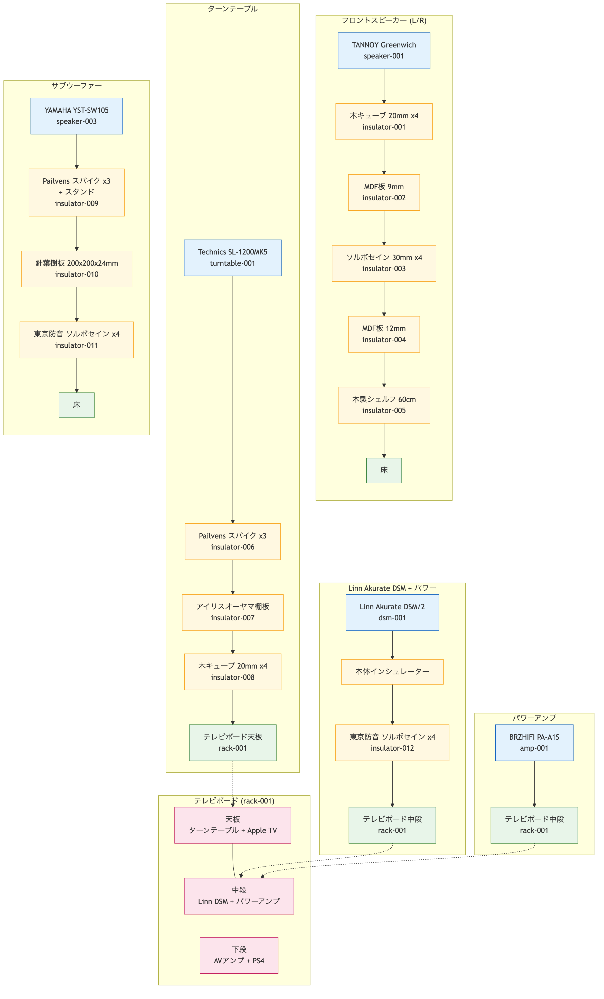
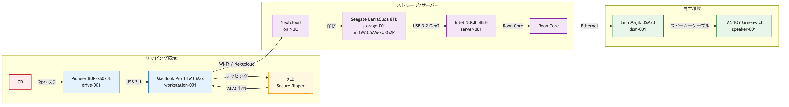

# Audio Infrastructure as Code

ホームオーディオシステムをコードベースで管理するリポジトリ。

## コンセプト

オーディオ環境の変更（機材の追加・交換、ケーブルの変更、セッティングの調整など）をGitで追跡し、
**音の変化と設定変更の因果関係**を明確に記録する。

## 現在のシステム構成

### ソース機器

| ID | 機器 | 役割 |
|----|------|------|
| server-001 | Intel NUC8i5BEH | Roon Core / MinimServer |
| turntable-001 | Technics SL-1200MK5 | アナログ再生 |
| player-001 | Apple TV 4K | ストリーミング/映像 |
| player-002 | PlayStation 4 Slim | ゲーム/映像 |

### プロセッサ/アンプ

| ID | 機器 | 役割 |
|----|------|------|
| dsm-001 | Linn Akurate DSM/2 | 2chオーディオ中心 (ストリーマー/DAC/プリアンプ) |
| amp-001 | BRZHIFI PA-A1S | パワーアンプ (純A級 20W×2) |
| avr-001 | Marantz NR1608 | サラウンド/映像切替 |

### スピーカー

| ID | 機器 | 配置 |
|----|------|------|
| speaker-001 | TANNOY Greenwich | フロント L/R |
| speaker-002 | Handmade Bookshelf | サラウンド L/R |
| speaker-003 | YAMAHA YST-SW105 | サブウーファー |

### 信号経路概要

```txt
[NUC / Apple TV / PS4] → [Marantz AVR] → [Linn DSM] → [PA-A1S] → [TANNOY]
[Technics SL-1200] → [Linn DSM (Phono)] → [PA-A1S] → [TANNOY]
[Linn DSM Pre Out] → [YAMAHA Subwoofer]
[Marantz AVR] → [Surround L/R]
```

### CDリッピング環境

| ID | 機器 | 役割 |
|----|------|------|
| drive-001 | Pioneer BDR-XS07JL | CDリッピング |
| workstation-001 | MacBook Pro 14" M1 Max | XLDでリッピング |
| storage-001 | Seagate BarraCuda 8TB | 音楽ライブラリ保存 |

```txt
CD → BDR-XS07JL → MacBook Pro (XLD/ALAC) → Nextcloud → NUC HDD → Roon → Linn DSM
```

## ディレクトリ構成

```bash
audio-infra/
├── inventory/              # 機材・ケーブル等のインベントリ (YAML)
│   ├── electronics.yaml    # アンプ、プレーヤー等
│   ├── speakers.yaml       # スピーカー
│   ├── cables.yaml         # ケーブル類
│   ├── accessories.yaml    # インシュレーター、ラック等
│   └── network.yaml        # サーバー、ルーター
├── topology/               # システム接続図 (Mermaid)
│   ├── system_diagram.mmd  # 信号・電源経路
│   └── physical_layout.mmd # 機器の物理的積層構造
├── room/                   # 部屋の環境情報
│   ├── layout.md
│   ├── linn/               # Linn Space Optimisation
│   ├── renders/            # レンダリング画像
│   └── scans/              # 3Dスキャンデータ
├── logs/                   # 試聴ログ
│   └── listening_log.md
└── photos/                 # 機材・セッティング写真
```

## インベントリファイル形式

### ID命名規則

- `dsm-001`, `avr-001`: 電子機器
- `speaker-001`: スピーカー
- `turntable-001`, `player-001`: ソース機器
- `spk-cable-001`, `rca-001`, `hdmi-001`, `lan-cable-001`: ケーブル
- `insulator-001`: インシュレーター
- `rack-001`: ラック
- `server-001`, `router-001`: ネットワーク機器

### 参照関係

ケーブルやインシュレーターは`connection`や`placement`フィールドで機器IDを参照:

```yaml
# cables.yaml
connection:
  from: "dsm-001"
  to: "speaker-001"

# accessories.yaml
placement:
  under: "speaker-001"
  layer: 1
```

## トポロジー図

### system_diagram.mmd - 信号・電源経路


機器間の信号と電源の接続関係を表す。エッジラベルにケーブルIDを記載。

### physical_layout.mmd - 物理的積層構造



機器とインシュレーターの物理的な積層（上から下への接触関係）を表す。

### ripping_workflow.mmd - CDリッピングワークフロー



CDからNUCへの音楽取り込みフロー。XLD設定は [photos/settings/xld_settings.png](photos/settings/xld_settings.png) を参照。

> **Note:** `.mmd`ファイルを編集後、pngへのレンダリングが必要。
> Mermaid CLI (`mmdc -s 3` で高解像度) または VSCode拡張等で生成。

## 運用ルール

### コミットメッセージ

機材変更時は以下の形式を推奨:

```txt
[add] DENON PMA-150H アンプ導入
[change] スピーカーケーブルをBelden 8470に変更
[adjust] スピーカー位置を内振り3度に調整
[room] 吸音パネルを左壁に追加
```

### ブランチ戦略

- `main`: 現在のシステム構成
- `experiment/*`: 試験的な変更（A/Bテスト等）

### LLMによるインベントリ管理

本リポジトリのYAMLファイルは、LLM（Claude等）との対話を通じて整備する運用を想定している。

- 機材の追加時: 型番や購入情報を伝えると、LLMがWeb検索でスペックを取得しYAMLに反映
- 接続変更時: 口頭で説明するとtopologyの更新を提案
- 過去の構成確認: Git履歴と合わせて変更経緯を追跡可能

## License

[CC0 1.0](LICENSE) - パブリックドメイン。自由にコピー・改変・配布できます。
